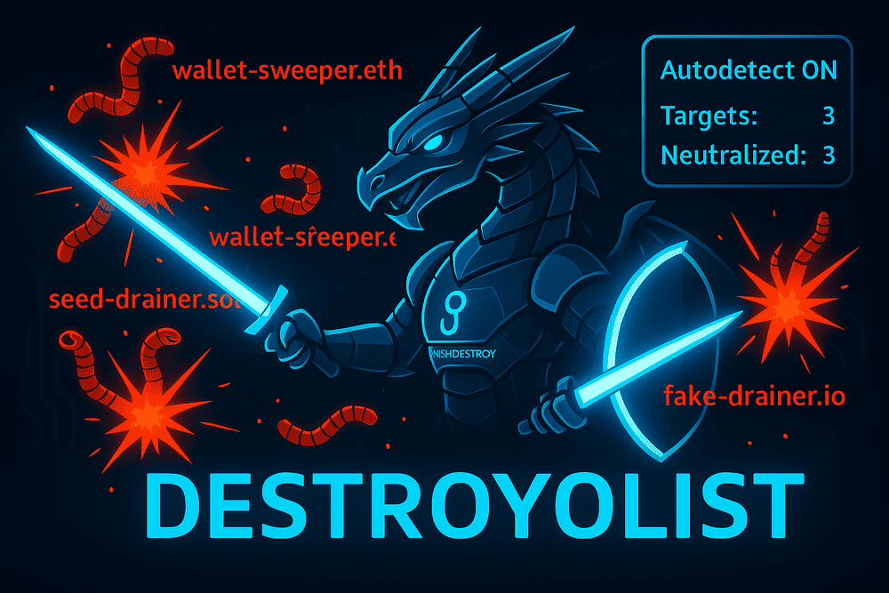

#  Destroylist: Phishing & Scam Domain Blacklist  

##  Quick Overview & Access 

### Project Status

### Domain Counters 

&color=purple&style=flat-square)
&color=blue&style=flat-square)

### Data Feeds 
| Data Feed | Description | Link |
|-----------|-------------|------|
| Primary Curated List | Core phishing/scam domains, real-time updates | [list.json](https://github.com/phishdestroy/destroylist/raw/main/list.json) |
| Active DNS-Verified | DNS-checked live threats | [active_domains.json](https://github.com/phishdestroy/destroylist/raw/main/dns/active_domains.json) |
| Community General | Broad aggregated blocklist, hourly updates | [blocklist.json](https://github.com/phishdestroy/destroylist/raw/main/community/blocklist.json) |
| Community Live | DNS-checked active community threats | [live_blocklist.json](https://github.com/phishdestroy/destroylist/raw/main/community/live_blocklist.json) |

### Connect With Us 
| Platform | Link |
|----------|------|
| Website | [phishdestroy.io](https://phishdestroy.io) |
| Telegram Alerts | [t.me/PhishDestroyAlerts](https://t.me/PhishDestroyAlerts) |
| Telegram Bot | [t.me/PhishDestroy_bot](https://t.me/PhishDestroy_bot) |
| Twitter / X | [x.com/Phish_Destroy](https://x.com/Phish_Destroy) |
| Ban Service | [ban.destroy.tools](https://ban.destroy.tools) |

---

##  About Destroylist 
> ⚡ **Live data collection began on July 1, 2025**

Destroylist is a powerful tool against phishing and scams, powered by **PhishDestroy**. It provides reliable intel for:
-  Firewalls
-  DNS resolvers
-  Browser extensions
-  Threat platforms

Protect the web, one domain at a time! 🌐

##    Key Info for Online Fraud Victims 

**Destroylist** aims to **disable malicious domains**, targeting scams, phishing, and other illicit sites to enhance internet safety.

Before a domain is added, we:
* **Scan it** across cybersecurity platforms for threat intelligence.
* **Send an official complaint** to the registrar and host (via WHOIS), detailing scan results, domain screenshots, and a request for client investigation. This complaint also notifies them of our public database entry.
* Per **ICANN rules**, registrars must review such complaints within **24 hours**.

 If you've been defrauded by a domain already listed here, check its addition date via the **[commit history](https://github.com/phishdestroy/destroylist/commits/main/)** or our [Telegram channel](https://t.me/PhishDestroyAlerts) / [Mastodon](https://mastodon.social/@phishdestroy). If the fraud occurred *after* a domain was listed, the registrar or host's delay may imply they **share a degree of responsibility for your loss**. **Potential victims of their clients will also be aware of this information.** These "good-natured" providers, who tolerate scammers on their platforms, might be uniquely positioned to assist you or your legal representatives.

##  Update Process 
-  **Gather:** Continuous phishing domain collection via PhishDestroy.
-  **Sync:** Cross-check with trusted sources.
-  **Add:** Real-time malicious domain integration.
-  **Clean:** Deduplicate and remove inactive/expired domains.

**Pro Cleanup Mode:**
-  Ping/DNS scans.
-  Remove expired domains.
-  (Coming) Ultra-active feeds.

##  Goals & Usage 

Use Destroylist for:
-  Security gear
-  Scripts & automation
-  Research dives
-  Monitoring ops

Open collaboration = Stronger security. Let's team up! 🤝

##  Data Breakdown 
- **Primary (`list.json`):** Core curated phishing list, JSON, real-time.
- **Active DNS (`dns/active_domains.json`):** Verified live threats, plug & play.
- **Community General (`community/blocklist.json`):** Broad aggregated blocklist, hourly.
- **Community Live (`community/live_blocklist.json`):** DNS-checked active community threats.

All JSON, ready to roll! 🚀

##  Historical Vault 

Archive of **500,000+** domains over 5+ years. Ideal for:
-  AI training
-  Research
-  Trends

>  Contact us at [phishdestroy.io](https://phishdestroy.io) for access!

##  Appeals Process 
Wrongly listed? Fix it fast:
-  [Appeals Form](https://phishdestroy.io/appeals/)
-  GitHub Issue with proof.

Accuracy first! 

##  License 

**MIT** – Free, open, yours to hack!

---

##  Join the Fight! 
Got ideas, sources, or improvements?
-  Detection tweaks
-  Integration tips
-  Fresh intel

Drop Issues/PRs – let's crush phishing together! 
